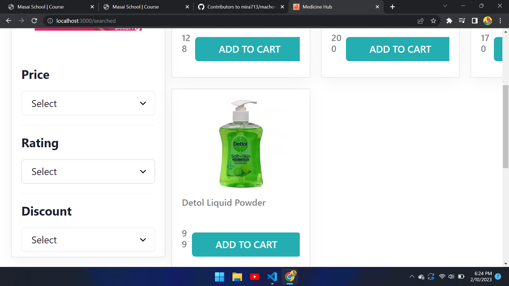
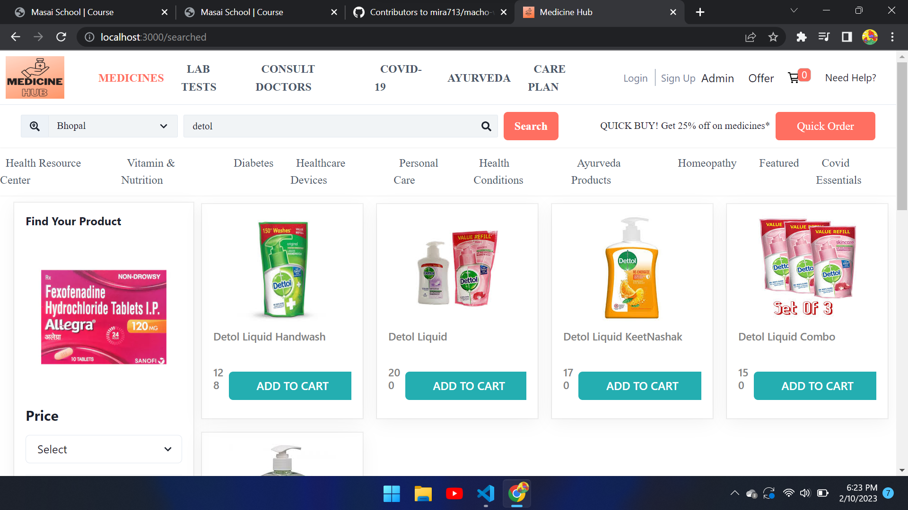
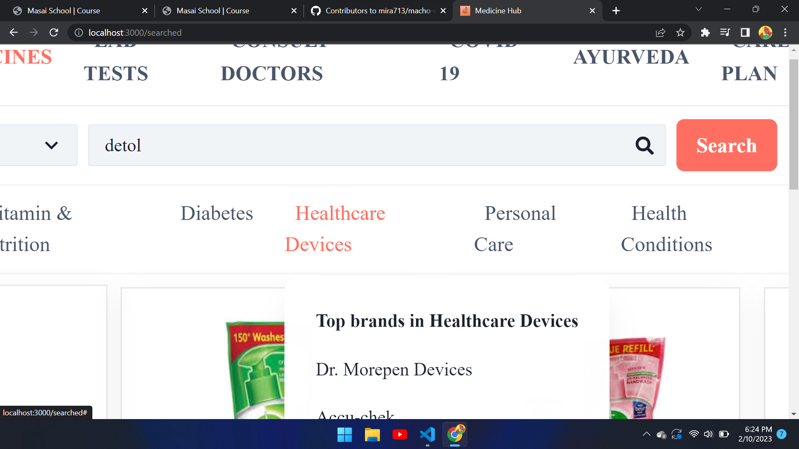
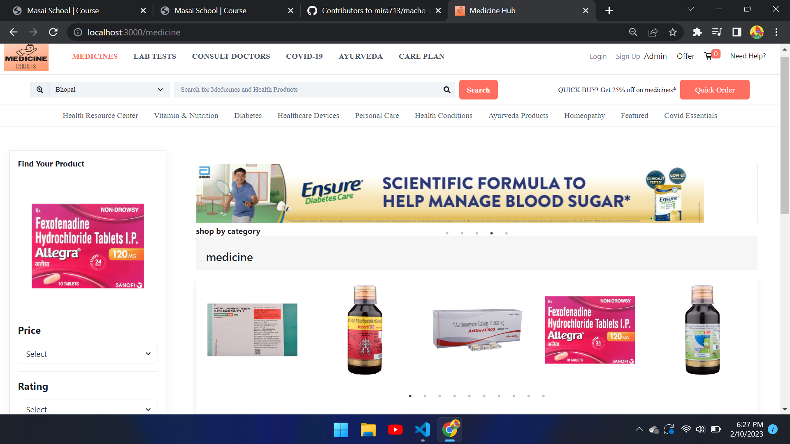
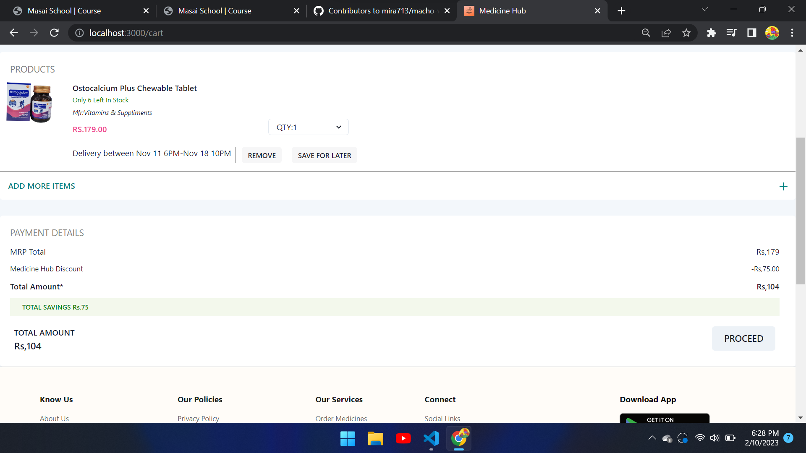
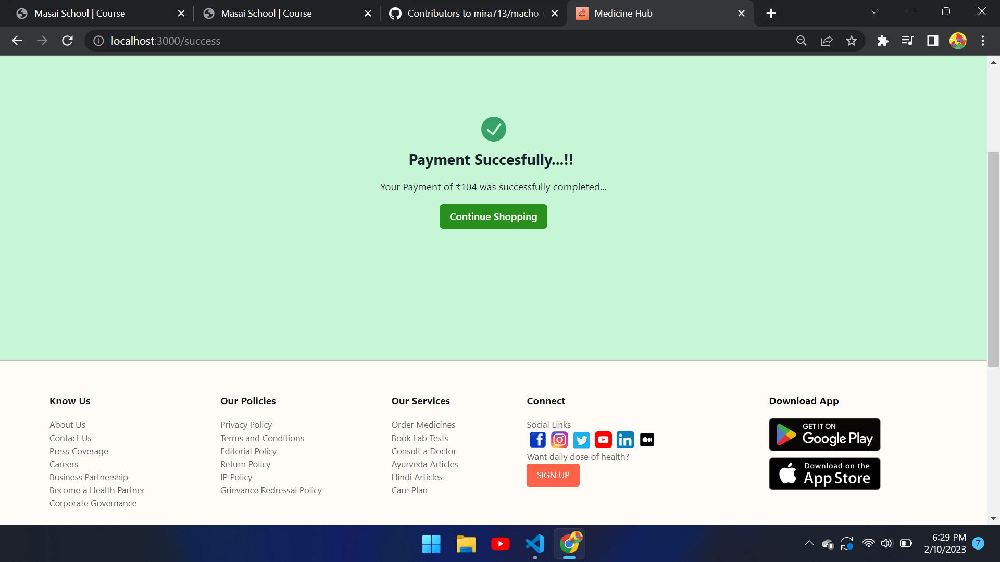

# macho-wind-7217
Netlify link :- https://medical-hub.vercel.app/

 
<h2>Tech Stack<h2/>
  <li>React.js</li>
  <li>Redux</li>
  <li>HTML</li>
  <li>CSS</li>
  <li>JavaScript</li>
  <li>Rest API</li>
  <li>Chakra UI</li>
  <li>BootStarp</li>
  <li>Styled Component</li>
  
 
<h2>Features :</h2> 
  <li>Homepage - The landing Page</li>
  <li>Login/Signup Page </li>
  <li>Admin Panel</li>
  <li>Product Page to browse all products based on categories</li>
  <li>Sort products by prices and ratings</li>
  <li>Filter products by brands and discounts</li>
  <li>Pagination</li>
  <li>Payment Page<li>
  <li>Checkout Page</li>
  
 
  <h4>Homepage</h4>
  
  
Footer of the website

  
  
Login form

  
  
We have an admin panel in our website

  
  
Sign-up form

  
  
Some sort functions based on price and rating

  
  
The main category/product page of our website

  
  
Search for the product here

  
  
some carousels

  
  
The main payment page

  
  
payment confirm!!

  
  

  <h4>Service Page</h4>
<h2>Team Members :</h2>
  <li><a href="">
Mitali Sinha</a></li>
  <li><a href="">Pallavi Jain</a></li>
  <li><a href="">
Samruddhi Chavan</a></li>
  <li><a href="">Priyanshu Pawar</a></li>
  <li><a href="">Shreyash Birajdar</a></li>
 

  
